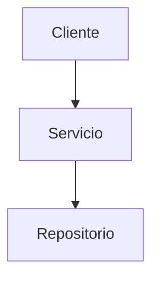

# Nadie nada nunca


**PyDay Hurlingham**
 
**29 de Noviembre 2025**
 
---

### Sasha

Líder Técnico en Mercado Libre 

*IT Staff || Financial Planning & Analysis*

--

### Sasha

Líder Técnico en **MELI**

*IT Staff || Financial Planning & Analysis*

<!-- .slide: data-transition="none" -->
--


--


--

<iframe width="560" height="315" src="https://www.youtube-nocookie.com/embed/OMPfEXIlTVE?si=pqTo6xzKa1qfn5us" title="Nothing is Something" frameborder="0" allow="accelerometer; autoplay; clipboard-write; encrypted-media; gyroscope; picture-in-picture; web-share" referrerpolicy="strict-origin-when-cross-origin" allowfullscreen></iframe> 

[Nothing is Something](https://www.youtube.com/watch?v=OMPfEXIlTVE) de Sandi Metz

---

## Layers



<!-- .element: class="fragment" -->

**Cliente** - Interfaz del usuario

<!-- .element: class="fragment" -->

**Servicio** - Lógica de negocio

<!-- .element: class="fragment" -->

**Repositorio** - Acceso a datos

<!-- .element: class="fragment" -->

---

## Ejemplo de Fragments

Usa `<!-- .element: class="fragment" -->` después de cada elemento para revelarlo uno por uno:


Este texto aparece primero
<!-- .element: class="fragment fade-in" -->


Este texto aparece segundo
<!-- .element: class="fragment fade-in" -->


Este texto se resalta en rojo
<!-- .element: class="fragment highlight-red" -->


Este texto aparece desde abajo
<!-- .element: class="fragment fade-up" -->

---

# Programación Orientada a Objetos (POO)

---

```python
str(1)
# => '1'
```

--

```python
1 + 1
# => 2 
```

--

```python
type(1)
# => int
```

--

```python
dir(int)
# => ['__abs__', '__add__', '__and__', '__bool__', '__class__', ..., '__str__', '__sub__', ...]
``` 

---

```python
1 == 1
# => True
```

--

```python
type(True)
# => bool
```

--

Las keywords de SmallTalk: 

> true, false, nil, self, super, thisContext

```python
import keyword
print(keyword.kwlist)
['False', 'None', 'True', 'and', 'as', 'assert', 'async', 'await', 'break', 'class', 'continue', 'def', 'del', 'elif', 'else', 'except', 'finally', 'for', 'from', 'global', 'if', 'import', 'in', 'is', 'lambda', 'nonlocal', 'not', 'or', 'pass', 'raise', 'return', 'try', 'while', 'with', 'yield']
```

[SmallTalk Syntax](https://en.wikipedia.org/wiki/Smalltalk#Syntax)
[Python Keywords](https://docs.python.org/3/reference/lexical_analysis.html#keywords)

--

-- 

```python
if (1 == 1):
    print("Verdadero")
else:
    print("Falso")
```

--

```python
if (True):
    print("Verdadero")
else:
    print("Falso")
```

--

```python
if ( truthy ):
    # Código a evaluar cuando es verdadero
else:
    # Código a evaluar cuando es falso
```

--

```python
if ( Objeto del cual conozco el tipo ):
    # Código que hace algo
else:
    # Código que hace otra cosa
```

--

```python
class Verdadero:
    @classmethod
    def si_verdadero(cls, codigo):
        codigo()
        return cls

    @classmethod
    def si_falso(cls, codigo):
        return cls
```

```python
class Falso:
    @classmethod
    def si_verdadero(cls, codigo):
        return cls
    @classmethod
    def si_falso(cls, codigo):
        codigo()
        return cls
```

--

```python
Verdadero.si_verdadero(lambda: print("Evalua si es Verdadero")).si_falso(lambda: print("Evalua si es Falso"))
```

---

```
from forbiddenfruit import curse
```

```python

```


---

**¿Qué pasaría si no existiese el `if`?**

--

```python
Biblioteca.buscar("Los Sorias")
# =>  <__main__.Libro at 0x7f0f49464d70>
```

```python
Biblioteca.buscar("")
# => None
```

--

```python
ids = ["Los Sorias", "", "Ocio"]

libros = [ Biblioteca.buscar(id) for id in ids ]
# => [<__main__.Libro object at 0x7f0f4bf35940> id:Los Sorias,
# None,
# <__main__.Libro object at 0x7f0f48e10190> id:Ocio]
```

```python
for libro in libros:
    print(libro.autor)
# => AttributeError: 'NoneType' object has no attribute 'autor'
```

--

Hay veces que `None` **es** nada.

--

```python
libros = [ libro for id in ids if (libro := Biblioteca.buscar(id)) ]
# => [<__main__.Libro object at 0x7f0f4bf35940> id:Los Sorias,
# <__main__.Libro object at 0x7f0f48e10190> id:Ocio]
```

--

Pero si le pasamos un mensaje a `None`, entonces **es algo**.

--

```python
ids = ["Los Sorias", "", "Ocio"]

libros = [ Biblioteca.buscar(id) for id in ids ]
# => [<__main__.Libro object at 0x7f0f4bf35940> id:Los Sorias,
# None,
# <__main__.Libro object at 0x7f0f48e10190> id:Ocio]

for libro in libros:
    print(libro.autor if libro else "Libro desconocido")
```

--


```python
ids = ["Los Sorias", "", "Ocio"]

libros = [ Biblioteca.buscar(id) for id in ids ]
# => [<__main__.Libro object at 0x7f0f4bf35940> id:Los Sorias,
# None,
# <__main__.Libro object at 0x7f0f48e10190> id:Ocio]

for libro in libros:
    print(libro and libro.autor)
```

--

```python
"Libro desconocido" if libro is None else libro.autor
```

```python
if libro is None:
    return "Libro desconocido"
else:
    return libro.autor
```

--

```python
if libro is None:
    return "Libro desconocido"
else:
    return libro.autor
```

```python
if ( Objeto del cual conozco el tipo ):
    # Código que hace algo
else:
    # Código que hace otra cosa
```

--

<div style="display: flex; justify-content: space-around; overflow: hidden;">
<div style="flex: 1 1 auto; padding: 10px;">

```python
if libro is None:
    return "Libro desconocido"
else:
    return libro.autor
```

</div>
<div style="flex: 1 1 auto; padding: 10px;">

```python
if ( Objeto del cual conozco el tipo ):
    # Yo proveo el comportamiento
else:
    # Le envío un mensaje al objeto
```

</div>
</div>

<small><sup>1</sup> Enviar mensaje == llamo un método</small>

--

## LOS CONDICIONALES

<h1 style="font-size: 3em; color: #e74c3c;" class="fragment">SE MULTIPLICAN</h1>

--

<div style="position: relative; height: 600px; width: 100%;">

<!-- Snippet central - sin modificar -->
<div style="position: absolute; top: 50%; left: 50%; transform: translate(-50%, -50%);">

```python
libro = Biblioteca.buscar(id)
"Libro desconocido" if libro is None else libro.autor
```

</div>

<!-- Primera transición - snippets en esquinas y parte superior -->
<div class="fragment">

<div style="position: absolute; top: 5%; left: 5%; transform: rotate(-15deg); opacity: 0.6; font-size: 0.7em;">

```python
libro = Biblioteca.buscar(id)
"Libro desconocido" if libro is None else libro.autor
```

</div>

<div style="position: absolute; top: 5%; right: 5%; transform: rotate(12deg); opacity: 0.6; font-size: 0.7em;">

```python
libro = Biblioteca.buscar(id)
"Libro desconocido" if libro is None else libro.autor
```

</div>

<div style="position: absolute; top: 30%; left: 2%; transform: rotate(-20deg); opacity: 0.6; font-size: 0.7em;">

```python
libro = Biblioteca.buscar(id)
"Libro desconocido" if libro is None else libro.autor
```

</div>

<div style="position: absolute; top: 30%; right: 2%; transform: rotate(18deg); opacity: 0.6; font-size: 0.7em;">

```python
libro = Biblioteca.buscar(id)
"Libro desconocido" if libro is None else libro.autor
```

</div>

</div>

<!-- Segunda transición - snippets en parte inferior y lados -->
<div class="fragment">

<div style="position: absolute; bottom: 5%; left: 5%; transform: rotate(10deg); opacity: 0.6; font-size: 0.7em;">

```python
libro = Biblioteca.buscar(id)
"Libro desconocido" if libro is None else libro.autor
```

</div>

<div style="position: absolute; bottom: 5%; right: 5%; transform: rotate(-15deg); opacity: 0.6; font-size: 0.7em;">

```python
libro = Biblioteca.buscar(id)
"Libro desconocido" if libro is None else libro.autor
```

</div>

<div style="position: absolute; bottom: 30%; left: 2%; transform: rotate(20deg); opacity: 0.6; font-size: 0.7em;">

```python
libro = Biblioteca.buscar(id)
"Libro desconocido" if libro is None else libro.autor
```

</div>

<div style="position: absolute; bottom: 30%; right: 2%; transform: rotate(-12deg); opacity: 0.6; font-size: 0.7em;">

```python
libro = Biblioteca.buscar(id)
"Libro desconocido" if libro is None else libro.autor
```

</div>

</div>

<!-- Mensaje "Libro desconocido" aproximándose en 3 transiciones -->
<div class="fragment" style="position: absolute; top: 20%; left: 20%; font-size: 1em; color: #e74c3c; font-weight: bold; opacity: 0.7; font-family: monospace; background: rgba(0, 0, 0, 0.7); padding: 10px; border-radius: 5px;">
"Libro desconocido"
</div>

<div class="fragment" style="position: absolute; top: 35%; left: 35%; font-size: 2em; color: #e74c3c; font-weight: bold; opacity: 0.85; font-family: monospace; background: rgba(0, 0, 0, 0.75); padding: 15px; border-radius: 8px;">
"Libro desconocido"
</div>

<div class="fragment" style="position: absolute; top: 50%; left: 50%; transform: translate(-50%, -50%); font-size: 4em; color: #e74c3c; font-weight: bold; opacity: 1; text-shadow: 0 0 20px rgba(231, 76, 60, 0.8); font-family: monospace; background: rgba(0, 0, 0, 0.85); padding: 20px; border-radius: 10px;">
"Libro desconocido !!!"
</div>

</div>

--

## ¿Qué pasa si quiero cambiar ese valor?

--

  


--


<div style="display: flex; justify-content: space-around; overflow: hidden;">
<div style="flex: 1 1 auto; padding: 10px;">

```python
if libro is None:
    return "Libro desconocido"
else:
    return libro.autor
```

</div>
<div style="flex: 1 1 auto; padding: 10px;">

```python
if ( Objeto del cual conozco el tipo ):
    # Yo proveo el comportamiento
else:
    # Le envío un mensaje al objeto
```

</div>
</div>

--

```python [1-5|1|2|4]
if libro is None:
    return "Libro desconocido"
else:
    return libro.autor
```

--

```python
class Libro:
    def autor(self):
        ...
```

```python
class NoneType:
    # No entiende el mensaje "autor"
```

--

```python
class Libro:
    def autor(self):
        ...
```

```python
class ???:
    def autor(self):
        return "Libro desconocido"
```

--

```python
class Libro:
    def autor(self):
        ...
```

```python
class LibroDesconocido
    def autor(self):
        return "Libro desconocido"
```

--

```python [4]
ids = ["Los Sorias", "", "Ocio"]

libros = [ 
    Biblioteca.buscar(id)
    for id in ids ]
# => [
# <__main__.Libro object at 0x7f0f49464ec0> id:Los Sorias,
# None,
# <__main__.Libro object at 0x7f0f48e11a90> id:Ocio
# ]

for libro in libros:
    if libro is None:
        print("Libro desconocido")
    else:
        print(libro.autor)
```
--

```python [4|4,8]
ids = ["Los Sorias", "", "Ocio"]

libros = [ 
    Biblioteca.buscar(id) or LibroDesconocido() 
    for id in ids ]
# => [
# <__main__.Libro object at 0x7f0f49464ec0> id:Los Sorias,
# None,
# <__main__.Libro object at 0x7f0f48e11a90> id:Ocio
# ]

for libro in libros:
    if libro is None:
        print("Libro desconocido")
    else:
        print(libro.autor)
```

--


```python [8|4,13|13-16|13-15]
ids = ["Los Sorias", "", "Ocio"]

libros = [ 
    Biblioteca.buscar(id) or LibroDesconocido() 
    for id in ids ]
# => [
# <__main__.Libro object at 0x7f0f49464ec0> id:Los Sorias,
# <__main__.LibroDesconocido at 0x7f0f49464c20>,
# <__main__.Libro object at 0x7f0f48e11a90> id:Ocio
# ]

for libro in libros:
    if libro is None:
        print("Libro desconocido")
    else:
        print(libro.autor)
```

--

```python [12-13]
ids = ["Los Sorias", "", "Ocio"]

libros = [ 
    Biblioteca.buscar(id) or LibroDesconocido() 
    for id in ids ]
# => [
# <__main__.Libro object at 0x7f0f49464ec0> id:Los Sorias,
# <__main__.LibroDesconocido at 0x7f0f49464c20>,
# <__main__.Libro object at 0x7f0f48e11a90> id:Ocio
# ]

for libro in libros:
        print(libro.autor)
```

--

```python [12-13]
ids = ["Los Sorias", "", "Ocio"]

libros = [ 
    Biblioteca.buscar(id) or LibroDesconocido() 
    for id in ids ]
# => [
# <__main__.Libro object at 0x7f0f49464ec0> id:Los Sorias,
# <__main__.LibroDesconocido at 0x7f0f49464c20>,
# <__main__.Libro object at 0x7f0f48e11a90> id:Ocio
# ]

for libro in libros:
    print(libro.autor)
```

--

```python [12-13]
ids = ["Los Sorias", "", "Ocio"]

libros = [ 
    Biblioteca.buscar(id) or LibroDesconocido() 
    for id in ids ]
# => [
# <__main__.Libro object at 0x7f0f49464ec0> id:Los Sorias,
# <__main__.LibroDesconocido at 0x7f0f49464c20>,
# <__main__.Libro object at 0x7f0f48e11a90> id:Ocio
# ]

for libro in libros:
    print(libro.autor)
# => 
# Alberto Laiseca
# Libro desconocido
# Fabián Casas
```


--

```python
class Libro:
    def autor(self):
        ...
```

```python
class LibroDesconocido
    def autor(self):
        return "Libro desconocido"
```

--

### Patrón del Objeto Nulo

*Null Object Pattern*
<!-- .element: class="fragment fade-out" -->


**'La Nada Activa'** 
<!-- .element: class="fragment" -->

--


```python [4]
ids = ["Los Sorias", "", "Ocio"]

libros = [ 
    Biblioteca.buscar(id) or LibroDesconocido() 
    for id in ids ]

for libro in libros:
    print(libro.autor)
# => 
# Alberto Laiseca
# Libro desconocido
# Fabián Casas
```

--

Tenemos que preferir conocer un objeto que duplicar comportamiento.

--

Tenemos que preferir conocer **pocos** objetos.

--

<div style="position: relative; height: 600px; width: 100%;">

<!-- Snippet central - sin modificar -->
<div style="position: absolute; top: 50%; left: 50%; transform: translate(-50%, -50%);">

```python
libro = Biblioteca.buscar(id) or LibroDesconocido()
libro.autor
```

</div>

<!-- Primera transición - snippets en esquinas y parte superior -->
<div class="fragment">

<div style="position: absolute; top: 5%; left: 5%; transform: rotate(-15deg); opacity: 0.6; font-size: 0.7em;">

```python
libro = Biblioteca.buscar(id) or LibroDesconocido()
libro.autor
```

</div>

<div style="position: absolute; top: 5%; right: 5%; transform: rotate(12deg); opacity: 0.6; font-size: 0.7em;">

```python
libro = Biblioteca.buscar(id) or LibroDesconocido()
libro.autor
```

</div>

<div style="position: absolute; top: 30%; left: 2%; transform: rotate(-20deg); opacity: 0.6; font-size: 0.7em;">

```python
libro = Biblioteca.buscar(id) or LibroDesconocido()
libro.autor
```

</div>

<div style="position: absolute; top: 30%; right: 2%; transform: rotate(18deg); opacity: 0.6; font-size: 0.7em;">

```python
libro = Biblioteca.buscar(id) or LibroDesconocido()
libro.autor
```

</div>

</div>

<!-- Segunda transición - snippets en parte inferior y lados -->
<div class="fragment">

<div style="position: absolute; bottom: 5%; left: 5%; transform: rotate(10deg); opacity: 0.6; font-size: 0.7em;">

```python
libro = Biblioteca.buscar(id) or LibroDesconocido()
libro.autor
```

</div>

<div style="position: absolute; bottom: 5%; right: 5%; transform: rotate(-15deg); opacity: 0.6; font-size: 0.7em;">

```python
libro = Biblioteca.buscar(id) or LibroDesconocido()
libro.autor
```

</div>

<div style="position: absolute; bottom: 30%; left: 2%; transform: rotate(20deg); opacity: 0.6; font-size: 0.7em;">

```python
libro = Biblioteca.buscar(id) or LibroDesconocido()
libro.autor
```

</div>

<div style="position: absolute; bottom: 30%; right: 2%; transform: rotate(-12deg); opacity: 0.6; font-size: 0.7em;">

```python
libro = Biblioteca.buscar(id) or LibroDesconocido()
libro.autor
```

</div>

</div>

<!-- Mensaje "Libro desconocido" aproximándose en 3 transiciones -->
<div class="fragment" style="position: absolute; top: 20%; left: 20%; font-size: 1em; color: #e74c3c; font-weight: bold; opacity: 0.7; font-family: monospace; background: rgba(0, 0, 0, 0.7); padding: 10px; border-radius: 5px;">
"LibroDesconocido"
</div>

<div class="fragment" style="position: absolute; top: 35%; left: 35%; font-size: 2em; color: #e74c3c; font-weight: bold; opacity: 0.85; font-family: monospace; background: rgba(0, 0, 0, 0.75); padding: 15px; border-radius: 8px;">
"LibroDesconocido"
</div>

<div class="fragment" style="position: absolute; top: 50%; left: 50%; transform: translate(-50%, -50%); font-size: 4em; color: #e74c3c; font-weight: bold; opacity: 1; text-shadow: 0 0 20px rgba(231, 76, 60, 0.8); font-family: monospace; background: rgba(0, 0, 0, 0.85); padding: 20px; border-radius: 10px;">
"LibroDesconocido ???"
</div>

</div>

--

```python
class Biblioteca:

    @staticmethod
    def buscar(id):
        ...
```

--


```python
class BibliotecaSegura:

    @staticmethod
    def buscar(id):
        return Biblioteca.buscar(id) or LibroDesconocido()
```

--

```python [2]
libros = [ 
    Biblioteca.buscar(id) or LibroDesconocido() 
    for id in ids ]
```

--

```python [2]
libros = [ 
    BibliotecaSegura.buscar(id) 
    for id in ids ]
```

--


```python [2]
libros = [ 
    BibliotecaSegura.buscar(id) 
    for id in ids ]
# => [
# <__main__.Libro object at 0x7f0f49464ec0> id:Los Sorias,
# <__main__.LibroDesconocido at 0x7f0f49464c20>,
# <__main__.Libro object at 0x7f0f48e11a90> id:Ocio
# ]
```

```python
for libro in libros:
    print(libro.autor)
# => 
# Alberto Laiseca
# Libro desconocido
# Fabián Casas
```

---


## EL PROBLEMA EN VIVO

```python
# Un gestor busca un libro por ID
class GestorInventario:
    def __init__(self, repositorio):
        self.repositorio = repositorio

    def procesar_libro(self, libro_id):
        libro = self.repositorio.buscar(libro_id)

        # ¡Atención! Si no se encuentra, libro es None
        return libro.obtener_portada()
```

---

## EL RESULTADO

### ¡AttributeError!

```
'NoneType' object has no attribute 'obtener_portada'
```

---

## El Parche Universal

### La Solución Anti-OO de Todos los Días

```python
def procesar_libro(self, libro_id):
    libro = self.repositorio.buscar(libro_id)

    if libro is None:
        return "placeholder_default.jpg"
    else:
        return libro.obtener_portada()
```

**Pregunta: ¿Hay una mejor manera de diseñar esto?**

---

## La Tesis de Sandi Metz

### La Programación Orientada a Objetos Perfecta NO USA if.

---

## Quién Soy

**[Tu Nombre]**

* [Tu Título y Especialidad]
* [Punto clave de tu experiencia]
* [Punto clave de tu experiencia]

---

# TEMA 1: NULL OBJECT

## (6 minutos)

---

## La Gran Idea

### "Nada es Siempre Algo"

* **Costo del if:** Acoplamiento, Fragilidad, Pruebas complejas
* El buen diseño elimina la necesidad de preguntar

---

## Solución 1: Null Object Pattern

### La "Nada Activa"

* **LibroNoEncontrado** (Objeto Nulo)
* Conformidad de Interfaz

---

## Implementación

```python
# El objeto que representa la AUSENCIA de un Libro
class LibroNoEncontrado:
    def obtener_portada(self):
        # Implementación de comportamiento neutro
        return "placeholder_default.jpg"

    def registrar_prestamo(self):
        pass # No tiene side effects
```

---

## Código Cliente Limpio

### Reemplazamos la Condición por Polimorfismo

* El GestorInventario confía en el mensaje
* El cliente no tiene que saber si es `Libro` o `LibroNoEncontrado`

---

## Aislamiento

### ¿Dónde va el if?

* La condición solo vive en el **Repositorio** o en el código de inicialización
* El Repositorio devuelve siempre un objeto funcional

---

# TEMA 2: NULL OBJECT EN DATA

## (2 minutos)

---

## Paralelo Funcional: Monoides

### El Objeto Nulo en Data Processing

* En el procesamiento de datos, la **Identidad Monoidal** es el "Null Object"
* Ejemplo Clásico: Si queremos appendear resultados de múltiples procesos

---

## La Lista Vacía y el DataFrame Vacío

* Si un proceso no encuentra datos ("Nada"), debe devolver la **Identidad**
* **Identidad:** Una lista vacía `[]` o un DataFrame vacío `pd.DataFrame()`
* **Beneficio:** Permite que el paso siguiente (concatenación) se ejecute sin if y sin errores

> **Nota:** Crear un DataFrame vacío puede ser más costoso que un simple if en loops muy rápidos. Es una compensación entre legibilidad/robustez y velocidad.

---

# TEMA 3: COMPOSICIÓN

## (7 minutos)

---

## Solución 3: Composición

### Evitando la Trampa de la Herencia

---

## La Trampa de la Herencia

### "Es un" (is-a) vs. "Tiene un" (has-a)

* La herencia es solo para la **especialización**
* Usarla para reúso de código causa **Explosión Combinatoria**

---

## El Pensamiento Correcto

### De "¿Qué ES este objeto?" a "¿Qué ROL juega?"

* Debemos aislar la variación y nombrar la abstracción

---

## El Rol y la Inyección

### Composición con Dependency Injection (DI)

**Principio:** El objeto principal depende de (usa) Roles que se le entregan en el constructor

---

## Código con Roles

```python
class Notificador:
    def __init__(self, metodo_alerta):
        self.alerta = metodo_alerta

    def enviar(self):
        self.alerta.ejecutar()

# La variación vive en 'metodo_alerta'
# (Email, SMS, Slack), no en 'Notificador'.
```

---

## La Victoria de la Composición

### ¡Puedes combinar cualquier Rol con cualquier Entidad!

* El código es más flexible
* Más fácil de probar
* Más mantenible

---

# CIERRE Y CALL TO ACTION

## (7 minutos)

---

## La Filosofía de la Nada

### El Principio de la Utilidad del Vacío

**Tao Te Ching:**
> "Trabajamos con el ser, pero el no-ser es lo que usamos."

La abstracción se esconde en el espacio vacío (la ausencia de if)

---

## Resumen Final

### Tres Pasos para el Código Limpio

1. **Encuentra la Nada:** Identifica la lógica condicional
2. **Nómbrala:** Crea el Rol (la abstracción)
3. **Hazla un Objeto:** Implementa el Null Object o usa la Composición

---

## ¡Preguntas!

**[Tu Contacto Principal / Twitter]**

---

## Servicios de Consultoría

### ¿Tu código sufre de if y acoplamiento?

* **Refactorización Estratégica:** Transformación de monolitos
* **Diseño Orientado a Objetos:** Aplicación de patrones avanzados
* **Auditoría de Código:** Identificación y corrección de fragilidad

---

## Tutorías y Mentoring

### Invierte en tu futuro como desarrollador senior

* Clases personalizadas de Python avanzado
* Sesiones de TDD y Pruebas Unitarias
* Formación en Arquitectura de Software

---

## Gracias

### Contacto y Redes

* **Email:** [Tu Email]
* **LinkedIn:** [Tu LinkedIn]
* ¡Hablemos de código!
